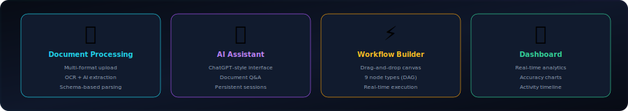
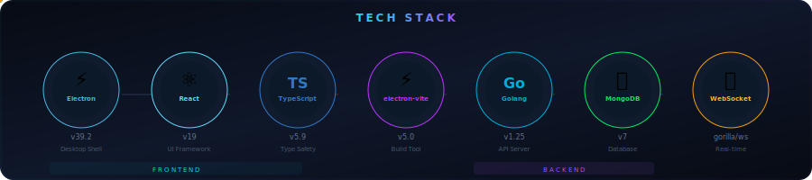

<p align="center">
  
</p>

<p align="center">
  <a href="https://github.com/AuRA-AI/aura-ai/actions"></a>
  <a href="LICENSE"></a>
  <a href="#"></a>
  <a href="#"></a>
  <a href="#"></a>
  <a href="#"></a>
  <a href="#"></a>
  <a href="#"></a>
</p>

<p align="center">
  <b>Intelligent Document Processing</b> — Upload, extract, transform, and export structured data<br/>
  from any document using AI-powered pipelines and a visual workflow builder.
</p>


<details open>
<summary><h2>📑 Table of Contents</h2></summary>

- [✦ Features](#-features)
- [✦ Architecture](#-architecture)
- [✦ Tech Stack](#-tech-stack)
- [✦ Repository Structure](#-repository-structure)
- [✦ Getting Started](#-getting-started)
- [✦ API Reference](#-api-reference)
- [✦ Pipeline Engine](#-pipeline-engine)
- [✦ AI Providers](#-ai-providers)
- [✦ Build & Packaging](#-build--packaging)
- [✦ Tooling & Scripts](#-tooling--scripts)
- [✦ Troubleshooting](#-troubleshooting)
- [✦ Contributing](#-contributing)
- [✦ License](#-license)

</details>


## ✦ Features

<p align="center">
  
</p>

### 📄 Document Processing
- **Multi-format upload** — PDF, images (JPEG/PNG/TIFF), scanned documents
- **OCR extraction** — Tesseract OCR with Poppler fallback for scanned PDFs
- **AI-powered field extraction** — Structured data extraction with confidence scoring
- **Schema-based extraction** — Define custom extraction templates for repeatable workflows
- **Batch analysis** — Process multiple documents with consistent schemas

### 🤖 Conversational AI Assistant
- **ChatGPT-style interface** — Full-page chat with session history sidebar
- **Document Q&A** — Load documents into conversation and ask natural language questions
- **Persistent sessions** — Chat history saved in MongoDB, browse and resume past conversations
- **Smart intent detection** — Auto-classifies user intent (list docs, select doc, ask question)
- **Field excerpts** — AI answers include references to extracted fields with confidence scores
- **Actionable error messages** — Clear guidance when API keys expire or rate limits hit

### ⚡ Visual Workflow Builder
- **Drag-and-drop canvas** — Build pipelines with React Flow visual editor
- **8 node types** — Document Select, AI Extract, Transform, Form Fill, Custom API, Review Gate, Condition Branch, Export
- **Real-time execution** — Live progress streaming via WebSocket
- **Human-in-the-loop** — Review gate nodes for manual approval/rejection
- **Pipeline templates** — Pre-built workflow templates for common use cases
- **Execution history** — Full run logs with per-node status tracking

### 📊 Dashboard & Analytics
- **Real-time stats** — Document counts, processing metrics, accuracy charts
- **Activity timeline** — Live feed of all system events
- **Recent documents** — Quick access to recently processed files
- **Accuracy visualization** — Extraction confidence charts and trends

### 🔐 Authentication & Security
- **Email/password auth** — Secure registration with bcrypt hashing
- **GitHub OAuth** — One-click GitHub sign-in with deep-link callback (`aura-ai://`)
- **JWT tokens** — Stateless authentication with configurable expiry
- **Context isolation** — Electron security best practices (`contextIsolation: true`)

### 📦 Export & Integration
- **Multi-format export** — CSV and Excel (XLSX) output
- **Custom API nodes** — Call external APIs from within pipelines
- **File management** — Download center for all exported files
- **Configurable AI providers** — Switch between AI models without restart


## ✦ Architecture

<p align="center">
  
</p>


## ✦ Tech Stack

<p align="center">
  
</p>

<table>
<tr>
<td width="50%">

### 🖥 Desktop App
| Technology | Version | Purpose |
|:-----------|:--------|:--------|
| Electron | 39.2 | Desktop shell |
| React | 19 | UI framework |
| TypeScript | 5.9 | Type safety |
| electron-vite | 5.0 | Build tooling |
| React Flow | 12.x | Pipeline canvas |
| Lucide React | — | Icon library |
| react-pdf | 10.x | PDF rendering |
| Zod | 4.x | Schema validation |
| react-router-dom | 7.x | Routing |

</td>
<td width="50%">

### ⚙️ Backend
| Technology | Version | Purpose |
|:-----------|:--------|:--------|
| Go | 1.25 | API server |
| MongoDB | 7 | Database |
| gorilla/websocket | 1.5 | Real-time events |
| golang-jwt | 5.x | Authentication |
| excelize | 2.10 | Excel export |
| Tesseract OCR | 5.x | Text extraction |
| Poppler | — | PDF rendering |
| bcrypt | — | Password hashing |
| OAuth2 | — | GitHub sign-in |

</td>
</tr>
</table>


## ✦ Repository Structure

```
aura-ai/
├── src/                          # Electron desktop application
│   ├── main/                     #   Main process (IPC, services)
│   │   ├── index.ts              #   App entry point
│   │   ├── ipc/                  #   IPC handlers
│   │   └── services/             #   Main process services
│   ├── preload/                  #   Preload scripts (context bridge)
│   │   └── index.ts              #   Secure API exposure
│   ├── renderer/                 #   React application
│   │   └── src/
│   │       ├── App.tsx           #   Root component + routing
│   │       ├── app.css           #   Global styles (glassmorphism theme)
│   │       ├── pages/            #   Page components
│   │       │   ├── Dashboard.tsx
│   │       │   ├── Documents.tsx
│   │       │   ├── AIAssistant.tsx    # ChatGPT-style AI chat
│   │       │   ├── Pipelines.tsx      # Workflow builder
│   │       │   ├── Templates.tsx
│   │       │   ├── APIConfig.tsx      # AI provider management
│   │       │   ├── Downloads.tsx
│   │       │   ├── Settings.tsx
│   │       │   └── AuthPage.tsx
│   │       ├── components/       #   Reusable UI components
│   │       │   ├── Sidebar.tsx
│   │       │   ├── workflow/     #     Pipeline builder components
│   │       │   └── templates/    #     Template components
│   │       ├── contexts/         #   React contexts (Auth, AI Provider)
│   │       └── data/             #   API client functions
│   └── shared/                   #   Shared types & constants
│       ├── types/                #   TypeScript type definitions
│       └── constants/            #   App-wide constants
│
├── backend/                      # Go REST API
│   ├── cmd/server/main.go        #   Server entry point
│   ├── internal/
│   │   ├── domain/               #   Domain models
│   │   ├── handler/              #   HTTP handlers (15 handler files)
│   │   ├── service/              #   Business logic layer
│   │   ├── repository/           #   MongoDB data access
│   │   ├── server/               #   Router, middleware wiring
│   │   ├── engine/               #   Pipeline execution engine
│   │   │   ├── executor.go       #     DAG-based executor
│   │   │   ├── registry.go       #     Node plugin registry
│   │   │   ├── broker.go         #     WebSocket event broker
│   │   │   └── nodes/            #     8 pipeline node types
│   │   ├── aiservice/            #   AI provider abstraction
│   │   │   ├── client.go         #     AIClient interface + ClientManager
│   │   │   ├── kilo.go           #     Kilo AI (OpenRouter) provider
│   │   │   └── copilot.go        #     GitHub Copilot provider
│   │   ├── auth/                 #   JWT utilities
│   │   ├── config/               #   Configuration loading
│   │   ├── crypto/               #   Encryption helpers
│   │   ├── database/             #   MongoDB connection
│   │   ├── logger/               #   Structured logging
│   │   ├── middleware/           #   Auth, CORS, logging, recovery
│   │   └── ocr/                  #   Tesseract + Poppler OCR
│   ├── seed/                     #   Demo data seeder
│   ├── Makefile                  #   Build & dev commands
│   └── Dockerfile                #   Container build
│
├── waitlist/                     # Landing page + waitlist API
├── tools/                        # Python PDF extraction utilities
├── designs/                      # HTML design prototypes
├── docker-compose.yml            # Local dev infrastructure
├── electron-builder.yml          # Desktop packaging config
├── electron.vite.config.ts       # Vite build configuration
├── LICENSE                       # MIT License
└── README.md
```


## ✦ Getting Started

### Prerequisites

| Requirement | Version | Required |
|:------------|:--------|:---------|
| Node.js | 20+ | ✅ |
| npm | 10+ | ✅ |
| Go | 1.25+ | ✅ |
| MongoDB | 7+ | ✅ |
| Docker + Compose | Latest | Recommended |
| Tesseract OCR | 5.x | Optional (for scanned PDFs) |
| Poppler (`pdftoppm`) | Latest | Optional (for image extraction) |

**Install OCR dependencies (macOS):**

```bash
brew install tesseract poppler
```

**Install OCR dependencies (Ubuntu/Debian):**

```bash
sudo apt install tesseract-ocr poppler-utils
```

### Installation

```bash
# 1. Clone the repository
git clone https://github.com/your-username/aura-ai.git
cd aura-ai

# 2. Install frontend dependencies
npm install

# 3. Install backend dependencies
cd backend && go mod tidy && cd ..
```

### Environment Variables

Create `backend/.env`:

```env
# ── Server ──────────────────────────────────────
PORT=8080
CORS_ORIGINS=http://localhost:5173
REQUEST_TIMEOUT=30s

# ── Database ────────────────────────────────────
MONGO_URI=mongodb://localhost:27017
MONGO_DB=aura_ai

# ── Security ────────────────────────────────────
JWT_SECRET=your-secret-key-here
ENCRYPTION_KEY=your-32-byte-encryption-key

# ── AI Provider (optional — configure via UI) ──
KILO_API_KEY=
GITHUB_MODELS_API_KEY=

# ── OCR ─────────────────────────────────────────
TESSERACT_PATH=tesseract

# ── GitHub OAuth ────────────────────────────────
GITHUB_CLIENT_ID=
GITHUB_CLIENT_SECRET=

# ── Logging ─────────────────────────────────────
LOG_LEVEL=info
```

### Running the App

#### Option A: Docker (Recommended)

```bash
# Start MongoDB + Redis
docker compose up -d mongodb redis

# Start Go backend
cd backend && make run

# Start Electron app (new terminal)
cd .. && npm run dev
```

#### Option B: Manual Setup

```bash
# Ensure MongoDB is running locally on port 27017

# Terminal 1 — Backend
cd backend
make run
# → http://localhost:8080

# Terminal 2 — Frontend
npm run dev
# → Electron window opens automatically
```

#### Verify Setup

```bash
# Health check
curl http://localhost:8080/api/v1/health

# Expected response:
# {"success":true,"data":{"status":"healthy","version":"1.0.0","db":"connected"}}
```

#### Seed Demo Data (Optional)

```bash
cd backend && make seed
```


## ✦ API Reference

Base URL: `http://localhost:8080/api/v1`

> All endpoints except auth and health require a valid JWT token in the `Authorization: Bearer <token>` header.

<details>
<summary><strong>🔐 Authentication</strong> — 9 endpoints</summary>

| Method | Endpoint | Description |
|:-------|:---------|:------------|
| `POST` | `/auth/register` | Register new user |
| `POST` | `/auth/login` | Login with email/password |
| `GET` | `/auth/github` | Initiate GitHub OAuth |
| `GET` | `/auth/github/callback` | GitHub OAuth callback |
| `GET` | `/auth/github/status` | Check OAuth pending status |
| `GET` | `/auth/me` | Get current user profile |
| `PATCH` | `/auth/me` | Update profile |
| `POST` | `/auth/me/password` | Change password |
| `GET` | `/auth/me/usage` | Get usage statistics |

</details>

<details>
<summary><strong>📄 Documents</strong> — 8 endpoints</summary>

| Method | Endpoint | Description |
|:-------|:---------|:------------|
| `GET` | `/documents` | List all documents |
| `GET` | `/documents/{id}` | Get document details |
| `POST` | `/documents` | Create document |
| `POST` | `/documents/upload` | Upload file (multipart) |
| `PATCH` | `/documents/{id}` | Update document |
| `DELETE` | `/documents/{id}` | Delete document |
| `POST` | `/documents/{id}/analyze` | Run AI extraction |
| `POST` | `/documents/{id}/export` | Export extracted data |

</details>

<details>
<summary><strong>🤖 AI Assistant</strong> — 5 endpoints</summary>

| Method | Endpoint | Description |
|:-------|:---------|:------------|
| `POST` | `/agent/sessions` | Create new chat session |
| `GET` | `/agent/sessions` | List all sessions (history) |
| `POST` | `/agent/chat` | Send message to assistant |
| `GET` | `/agent/sessions/{id}` | Get session with messages |
| `DELETE` | `/agent/sessions/{id}` | Delete session |

</details>

<details>
<summary><strong>⚡ Pipelines</strong> — 10 endpoints</summary>

| Method | Endpoint | Description |
|:-------|:---------|:------------|
| `GET` | `/pipelines` | List pipelines |
| `GET` | `/pipelines/{id}` | Get pipeline details |
| `POST` | `/pipelines` | Create pipeline |
| `PATCH` | `/pipelines/{id}` | Update pipeline |
| `DELETE` | `/pipelines/{id}` | Delete pipeline |
| `POST` | `/pipelines/{id}/execute` | Execute pipeline |
| `GET` | `/pipelines/{id}/runs` | List execution runs |
| `GET` | `/pipelines/{id}/runs/{runId}` | Get run details |
| `POST` | `/pipelines/{id}/runs/{runId}/cancel` | Cancel execution |
| `POST` | `/pipelines/{id}/validate` | Validate pipeline DAG |

</details>

<details>
<summary><strong>✅ Review Gate</strong> — 2 endpoints</summary>

| Method | Endpoint | Description |
|:-------|:---------|:------------|
| `POST` | `/runs/{runId}/nodes/{nodeId}/approve` | Approve review node |
| `POST` | `/runs/{runId}/nodes/{nodeId}/reject` | Reject review node |

</details>

<details>
<summary><strong>📊 Dashboard & Activity</strong> — 5 endpoints</summary>

| Method | Endpoint | Description |
|:-------|:---------|:------------|
| `GET` | `/dashboard/stats` | Aggregate statistics |
| `GET` | `/dashboard/chart` | Chart data |
| `GET` | `/dashboard/recent` | Recent documents |
| `GET` | `/activity` | Activity feed |
| `POST` | `/activity` | Log activity |

</details>

<details>
<summary><strong>🧩 Schemas & Templates</strong> — 9 endpoints</summary>

| Method | Endpoint | Description |
|:-------|:---------|:------------|
| `GET` | `/schemas` | List extraction schemas |
| `POST` | `/schemas` | Create schema |
| `GET` | `/schemas/{id}` | Get schema |
| `PATCH` | `/schemas/{id}` | Update schema |
| `DELETE` | `/schemas/{id}` | Delete schema |
| `GET` | `/form-templates` | List form templates |
| `POST` | `/form-templates` | Create form template |
| `GET` | `/form-templates/{id}` | Get form template |
| `DELETE` | `/form-templates/{id}` | Delete form template |

</details>

<details>
<summary><strong>🔧 AI Providers</strong> — 7 endpoints</summary>

| Method | Endpoint | Description |
|:-------|:---------|:------------|
| `GET` | `/ai-providers` | List all providers |
| `GET` | `/ai-providers/{type}` | Get provider config |
| `POST` | `/ai-providers` | Create provider |
| `PATCH` | `/ai-providers/{type}` | Update provider |
| `DELETE` | `/ai-providers/{type}` | Delete provider |
| `POST` | `/ai-providers/{type}/activate` | Set active provider |
| `POST` | `/ai-providers/{type}/test` | Test connection |

</details>

<details>
<summary><strong>📦 Exports & Files</strong> — 3 endpoints</summary>

| Method | Endpoint | Description |
|:-------|:---------|:------------|
| `GET` | `/exports` | List export files |
| `DELETE` | `/exports/{filename}` | Delete export file |
| `GET` | `/files/*` | Serve uploaded/exported files |

</details>

<details>
<summary><strong>🔌 WebSocket</strong></summary>

| Endpoint | Description |
|:---------|:------------|
| `ws://localhost:8080/api/v1/ws` | Real-time pipeline events & progress updates |

**Event types:** `node_started`, `node_completed`, `node_failed`, `pipeline_completed`, `pipeline_failed`, `progress`

</details>


## ✦ Pipeline Engine

The pipeline engine executes visual workflows as directed acyclic graphs (DAGs). Each node processes data and passes results to connected nodes via the execution broker.

<p align="center">
  
</p>

### Node Types

| Node | Description | Use Case |
|:-----|:------------|:---------|
| 📥 **Document Select** | Pick source documents | Start of any pipeline |
| 📄 **Ingest** | Bulk document ingestion | Loading from external sources |
| 🧠 **AI Extract** | Run AI field extraction | Structured data extraction |
| 🔄 **Transform** | Map, filter, reshape data | Data normalization |
| 📝 **Form Fill** | Populate form templates | Automated document generation |
| 🌐 **Custom API** | Call external HTTP endpoints | Third-party integrations |
| ✅ **Review** | Human approval/rejection gate | Quality control checkpoint |
| 🔀 **Condition** | Branch based on field values | Conditional routing |
| 📤 **Export** | Output to CSV/Excel | Final data delivery |

**Capabilities:**
- 📡 **Real-time streaming** — Progress events streamed via WebSocket
- ⏹ **Cancellation** — Running pipelines can be cancelled mid-execution
- 🔍 **Validation** — DAG connectivity and config validated before execution
- 📋 **Run history** — Full execution logs with per-node status tracking
- 🔁 **Re-execution** — Re-run pipelines with modified configurations


## ✦ AI Providers

AuRA AI supports a pluggable AI provider system. Switch providers at runtime through the UI — no server restart required.

| Provider | Endpoint | Default Model | Features |
|:---------|:---------|:--------------|:---------|
| **Kilo AI** | `api.kilo.ai/api/openrouter/` | `minimax/minimax-m2.5:free` | Chat, extraction, conversation |
| **GitHub Copilot** | `models.github.ai/inference/` | `gpt-4o-mini` | Chat, extraction, conversation |

### Provider Capabilities

| Feature | Description |
|:--------|:------------|
| 🔄 Hot-swappable | Thread-safe `ClientManager` with mutex-protected swap |
| 🧪 Connection testing | Verify credentials before activating |
| 💬 Multi-turn conversation | Context-aware document Q&A |
| 📄 Schema-driven extraction | Extract fields matching custom schemas |
| 📖 Per-page extraction | Process large documents page by page |
| ⏱ 120s timeout | Configurable request timeout per provider |

### Adding a New Provider

Implement the `AIClient` interface in `backend/internal/aiservice/`:

```go
type AIClient interface {
    Chat(ctx context.Context, systemPrompt, userMessage string) (string, error)
    ChatConversation(ctx context.Context, messages []ConversationMessage) (string, error)
    ExtractFields(ctx context.Context, text string) (string, error)
    ExtractFieldsFromPage(ctx context.Context, text string, pageNum int) (string, error)
    ExtractFieldsFromPageWithSchema(ctx context.Context, text string, pageNum int, schema string) (string, error)
}
```


## ✦ Build & Packaging

### Development Build

```bash
npm run dev              # Start Electron + Vite dev server
npm run build            # TypeScript check + production build
```

### Desktop Packaging

| Platform | Command | Output |
|:---------|:--------|:-------|
| macOS Universal | `npm run build:mac` | DMG + ZIP (ARM64 + Intel) |
| macOS Apple Silicon | `npm run build:mac:arm64` | DMG + ZIP |
| macOS Intel | `npm run build:mac:x64` | DMG + ZIP |
| Windows | `npm run build:win` | NSIS installer |
| Linux | `npm run build:linux` | AppImage + Snap + Deb |

### Backend-Only Build

```bash
cd backend

make build                    # Native binary → bin/aura-api
make build-mac-universal      # macOS fat binary (lipo ARM64 + x86_64)
make build-mac-arm64          # macOS Apple Silicon
make build-mac-amd64          # macOS Intel
```

### Packaging Details

- **App ID:** `com.aura-ai.desktop`
- **Deep-link protocol:** `aura-ai://`
- **Backend bundled:** Universal Go binary included at `Resources/bin/aura-api`
- **macOS:** Hardened runtime enabled, notarization-ready with entitlements
- **Auto-update:** Electron Updater configured for production releases


## ✦ Tooling & Scripts

### Frontend

| Command | Description |
|:--------|:------------|
| `npm run dev` | Start development server |
| `npm run build` | Production build with type checking |
| `npm run lint` | ESLint check |
| `npm run format` | Prettier formatting |
| `npm run typecheck` | Full TypeScript compilation check |
| `npm run typecheck:web` | Check renderer types only |
| `npm run typecheck:node` | Check main process types only |

### Backend

| Command | Description |
|:--------|:------------|
| `make run` | Start dev server (with Tesseract check) |
| `make build` | Build production binary |
| `make vet` | Go vet + build verification |
| `make seed` | Seed demo data |
| `make tidy` | `go mod tidy` |
| `make clean` | Remove build artifacts |
| `go test ./...` | Run all tests |

### Docker

```bash
docker compose up -d               # Start all services
docker compose up -d mongodb redis  # Infrastructure only
docker compose down                 # Stop all services
docker compose logs -f backend      # Tail backend logs
```

### Python Tools

```bash
cd tools
pip install -r requirements.txt
python pdf_extractor.py /path/to/pdfs -o output.csv
```


## ✦ Troubleshooting

<details>
<summary><strong>Backend not reachable from the UI</strong></summary>

- Verify the backend is running:
  ```bash
  curl http://localhost:8080/api/v1/health
  ```
- Check `CORS_ORIGINS` in `backend/.env` includes `http://localhost:5173`
- Ensure no other process is using port 8080:
  ```bash
  lsof -ti :8080
  ```

</details>

<details>
<summary><strong>AI extraction or chat returns errors</strong></summary>

| Error Message | Solution |
|:------|:---------|
| "API key invalid or expired" | Go to **API Configuration** and update credentials |
| "Rate limit exceeded" | Wait and retry, or switch to a different provider |
| "Request timed out" | Try a smaller document or increase `REQUEST_TIMEOUT` |
| No response at all | Ensure at least one provider is configured in **API Configuration** |

</details>

<details>
<summary><strong>OCR not working for scanned PDFs</strong></summary>

```bash
# macOS
brew install tesseract poppler

# Ubuntu/Debian
sudo apt install tesseract-ocr poppler-utils

# Verify installation
tesseract --version && pdftoppm -v
```

Check the startup log for: `tesseract OCR initialized`

</details>

<details>
<summary><strong>MongoDB connection issues</strong></summary>

```bash
# Check if MongoDB is running
docker compose ps

# Or test direct connection
mongosh --eval "db.runCommand({ping:1})"

# Verify env vars
grep MONGO backend/.env
```

</details>

<details>
<summary><strong>Electron build fails</strong></summary>

1. Run `npm run typecheck` to catch TypeScript errors
2. Ensure backend binary exists: `cd backend && make build-mac-universal`
3. Clear build cache: `rm -rf out/ dist/`
4. Check `electron-builder.yml` for correct binary paths

</details>


## ✦ Contributing

Contributions are welcome! Here's how to get started:

1. **Fork** the repository
2. **Create** a feature branch
   ```bash
   git checkout -b feature/amazing-feature
   ```
3. **Commit** your changes using [conventional commits](https://www.conventionalcommits.org/)
   ```bash
   git commit -m 'feat: add amazing feature'
   ```
4. **Push** to your branch
   ```bash
   git push origin feature/amazing-feature
   ```
5. **Open** a Pull Request

### Development Guidelines

- Follow existing code patterns and project structure
- Run `npm run lint` and `make vet` before committing
- Add tests for new backend features (`go test ./...`)
- Use TypeScript strict mode — no `any` types


## ✦ License

Distributed under the **MIT License**. See [`LICENSE`](LICENSE) for details.


<p align="center">
  
</p>
